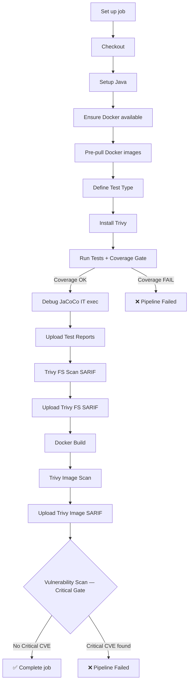

# 🚀 CI/CD Pipeline — Quality & Security at Every Step

> *"We don't ship features. We ship confidence."*

---

## Visão Geral

Este pipeline representa a espinha dorsal do nosso processo de entrega contínua. Ele foi projetado para garantir que **nenhum código defeituoso ou vulnerável chegue à produção** — combinando automação de testes, análise de cobertura e varredura de segurança em uma única esteira coesa.

O job `test` é executado em **1 minuto e 46 segundos** e orquestra mais de 20 etapas críticas, cobrindo desde a inicialização do ambiente até a validação de vulnerabilidades na imagem Docker final.

---

## 🗺️ Arquitetura do Pipeline

```
┌─────────────────────────────────────────────────────────────┐
│                        CI/CD PIPELINE                       │
│                                                             │
│  ┌─────────────┐   ┌──────────────┐   ┌─────────────────┐  │
│  │  AMBIENTE   │ → │    TESTES    │ → │   SEGURANÇA     │  │
│  │  & SETUP    │   │  & COBERTURA │   │   & QUALIDADE   │  │
│  └─────────────┘   └──────────────┘   └─────────────────┘  │
│                                                             │
│  Java · Docker     JaCoCo · Gate       Trivy · SARIF · CVE │
└─────────────────────────────────────────────────────────────┘
```

---

## 📋 Etapas Detalhadas

### 🔧 Fase 1 — Preparação do Ambiente

#### `Set up job`
Ponto de entrada de toda a execução. O runner inicializa o ambiente de trabalho, carrega variáveis de contexto e registra os metadados do workflow — quem disparou, qual branch, qual commit.

#### `Checkout`
Faz o clone do repositório no runner. A partir daqui, todo o código que será testado e validado está disponível localmente na máquina de CI.

#### `Setup Java`
Configura a JDK na versão correta definida no workflow (ex.: Java 17 ou 21). Garante consistência entre o ambiente local dos desenvolvedores e o ambiente de CI — sem o famoso *"funciona na minha máquina"*.

#### `Ensure Docker available`
Valida que o Docker Engine está operacional antes de qualquer etapa que dependa de containers. Falhar aqui é melhor do que falhar silenciosamente mais tarde.

#### `Pre-pull Docker images`
Faz o download antecipado das imagens necessárias (banco de dados, mocks, dependências) antes dos testes subirem. Isso reduz o tempo de espera durante a execução e evita timeouts por download lento em runtime.

---

### 🧪 Fase 2 — Execução de Testes & Cobertura

#### `Define Test Type`
Define dinamicamente qual suite de testes será executada — pode ser `unit`, `integration` ou `e2e`. Essa flexibilidade permite que o mesmo pipeline sirva múltiplos contextos sem duplicação de código.

#### `Run Tests + Coverage Gate`
O coração do pipeline. Aqui os testes são executados e o **JaCoCo** coleta métricas de cobertura de código em tempo real. O *Coverage Gate* é o guardião: se a cobertura cair abaixo do threshold definido (ex.: 80%), o pipeline falha **intencionalmente**.

> Sem qualidade mínima, sem merge. Simples assim.

#### `Debug JaCoCo IT exec`
Etapa de diagnóstico que inspeciona o arquivo `.exec` gerado pelo JaCoCo para testes de integração. Útil para troubleshooting quando a cobertura não é computada corretamente — logs detalhados aqui salvam horas de investigação.

#### `Upload Test Reports (Artifacts)`
Os relatórios de teste (HTML, XML, JaCoCo) são publicados como **artefatos do workflow**. Qualquer pessoa pode baixá-los diretamente pelo GitHub Actions — rastreabilidade total de cada execução.

---

### 🔐 Fase 3 — Segurança (Trivy + SARIF)

#### `Install Trivy`
Instala o [Trivy](https://trivy.dev/), scanner de segurança open-source da Aqua Security. Ele é capaz de detectar CVEs em dependências, imagens Docker, configurações de IaC e muito mais.

#### `Trivy FS Scan (SARIF)`
Varredura do **filesystem do projeto** — analisa dependências declaradas no `pom.xml`, `package.json` e similares em busca de vulnerabilidades conhecidas. O resultado é exportado em formato **SARIF** (Static Analysis Results Interchange Format).

#### `Upload Trivy FS SARIF`
O relatório SARIF do filesystem é enviado para o **GitHub Advanced Security (GHAS)**, onde os alertas aparecem diretamente na aba *Security → Code scanning* do repositório. Vulnerabilidades ficam visíveis no contexto do código.

#### `Docker Build (app image)`
Constrói a imagem Docker da aplicação com base no `Dockerfile` do projeto. Essa é a imagem que — se tudo der certo — chegará ao ambiente de produção.

#### `Trivy Image Scan (Report)`
Agora o Trivy varre a **imagem Docker construída**. Diferente da varredura de filesystem, aqui são analisadas as camadas da imagem, incluindo o sistema operacional base e todos os binários instalados.

#### `Upload Trivy Image SARIF`
O relatório da varredura da imagem também é enviado ao GHAS. Duas fontes de verdade sobre segurança: código + container.

#### `Vulnerability Scan (Critical Gate)`
**O guardião de segurança.** Se qualquer vulnerabilidade com severidade `CRITICAL` for encontrada, o pipeline falha aqui. Sem exceção. Sem bypass. Nenhuma imagem vulnerável avança no fluxo de deploy.

> Este é o momento em que a pipeline diz: *"Não hoje."*

---

### 🧹 Fase 4 — Finalização & Cleanup

#### `Post Upload Trivy Image SARIF`
#### `Post Upload Trivy FS SARIF`
#### `Post Setup Java`
#### `Post Checkout`

Etapas de pós-execução gerenciadas automaticamente pelo GitHub Actions. Realizam limpeza de recursos, flush de caches temporários e encerramento ordenado dos serviços iniciados durante o job. Garantem que o runner não herde estado sujo para a próxima execução.

#### `Complete job`
Sinaliza o encerramento do job com status `success`. Este sinal é o que desbloqueia etapas subsequentes no workflow — como deploy em staging ou notificação para o time via Slack.

---

## 🏗️ Pilares da Arquitetura

| Pilar | Ferramentas | Propósito |
|---|---|---|
| **Testes** | JUnit, JaCoCo | Validar comportamento e cobertura |
| **Containers** | Docker, Docker Compose | Isolamento e reprodutibilidade |
| **Segurança** | Trivy, SARIF, GHAS | Detecção de vulnerabilidades |
| **Observabilidade** | Artifacts, Reports | Rastreabilidade de cada execução |
| **Gates** | Coverage Gate, Critical Gate | Garantia de qualidade mínima |

---

## 🔒 Os Gates de Qualidade

O pipeline possui **dois gates explícitos** que impedem avanço sem aprovação automática:

```
Coverage Gate ──────────────────────── Critical Gate
     │                                       │
     ▼                                       ▼
Cobertura < threshold?              CVE Critical encontrado?
     │                                       │
    YES → ❌ Pipeline falha             YES → ❌ Pipeline falha
     │                                       │
    NO  → ✅ Continua                   NO  → ✅ Continua
```

Esses gates não são burocracia — são **acordos de qualidade** que a equipe fez consigo mesma.

---

## 📊 Fluxo Completo



---

## 💡 Por que esse pipeline importa?

Um pipeline de CI/CD bem construído não é apenas automação — é **cultura de engenharia materializada em código**. Cada etapa aqui reflete uma decisão consciente da equipe:

- **Testamos antes de buildar** → feedback rápido para o desenvolvedor
- **Escaneamos o filesystem E a imagem** → cobertura de segurança em camadas
- **Gates automáticos** → qualidade não depende de disciplina individual, está no processo
- **Tudo é artefato** → rastreabilidade total, sem achismo em post-mortem

> O melhor bug é aquele que nunca chega ao usuário.  
> O segundo melhor é aquele que o pipeline captura antes do deploy.

---

## 🛠️ Stack de Referência

```yaml
linguagem:     Java (17+)
build:         Maven / Gradle
cobertura:     JaCoCo
containers:    Docker
segurança:     Trivy (Aqua Security)
formato:       SARIF v2.1.0
integração:    GitHub Actions + GitHub Advanced Security
```

---

*Documentação gerada com base na execução do job `test` — succeeded in 1m 46s.*  
*Mantenha este documento atualizado sempre que o pipeline evoluir.*